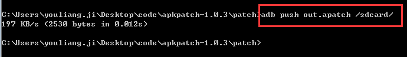
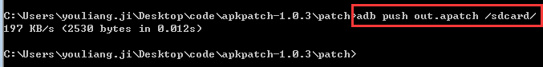
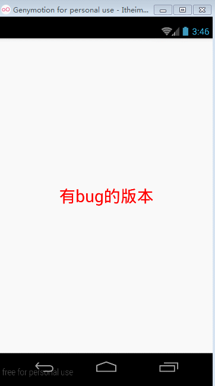
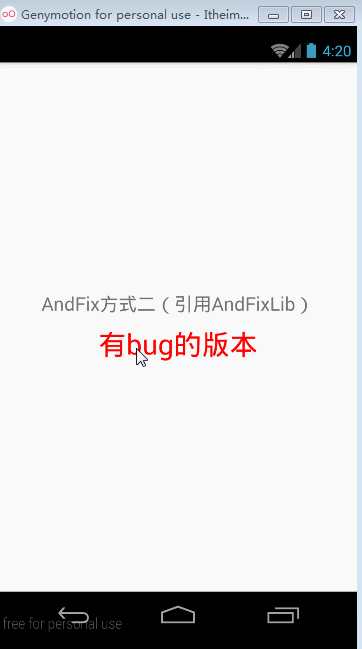

## AndFix使用

官方工程：[https://github.com/alibaba/AndFix](https://github.com/alibaba/AndFix)

### 方式一：直接引用arr包

* 1.apkpatch工具生成热补丁文件

* 2.生成热补丁文件导入sdcard卡(导入前别忘了卸载新版本app，安装旧版本)

* 3.运行旧版本，发现修复成功

### 方式二：引用AndFixLib

* 和方式一的区别
	* （1）需要用AndFixLib工程
	* （2）需要引入so库
	